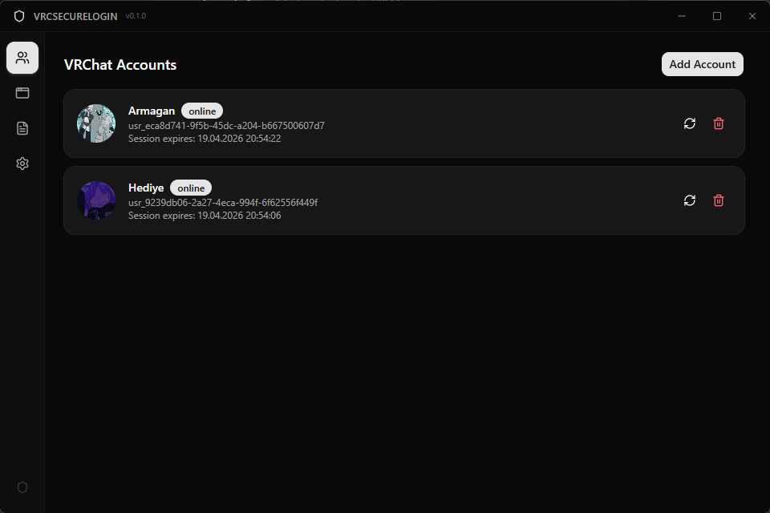
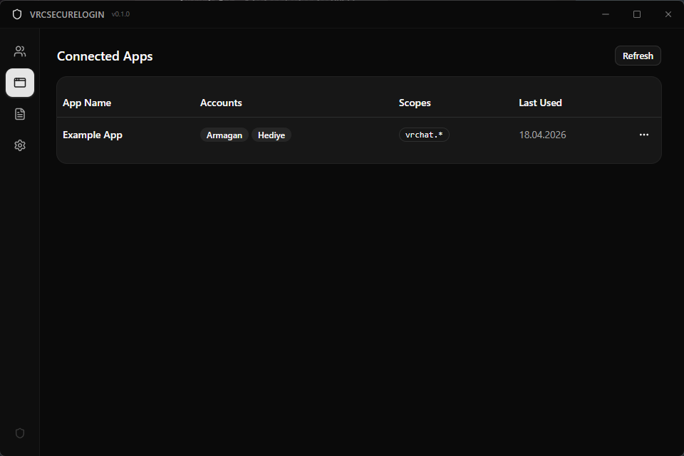
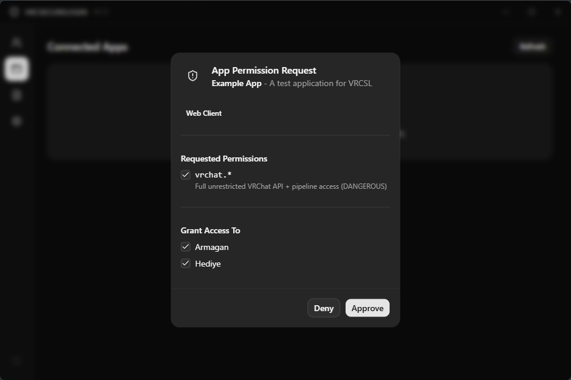
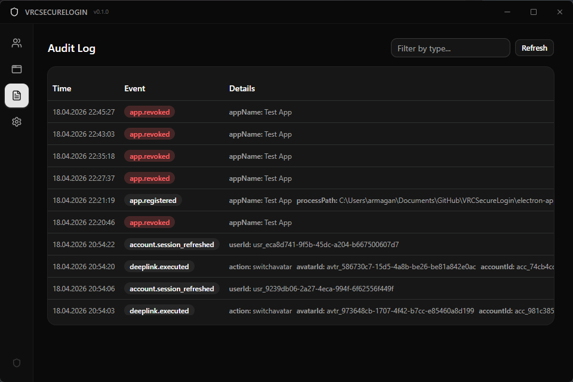
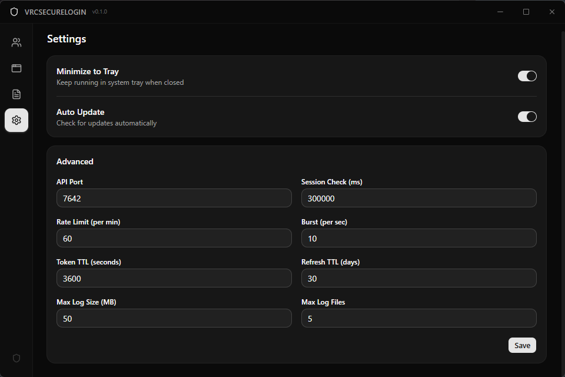
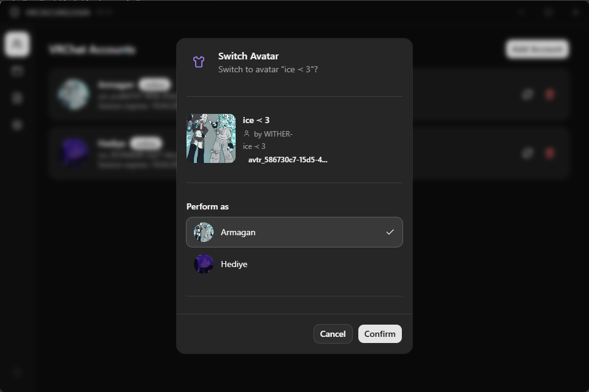

<p align="center">
  
</p>

# VRCSecureLogin

A secure local credential vault and API proxy for VRChat accounts.

---

VRCSecureLogin (VRCSL) eliminates the need to hand over your VRChat username and password to every third-party application or website. It stores your credentials securely on your machine, keeps your sessions alive, and lets third-party tools access VRChat on your behalf through a scoped, consent-driven local API.

---

## Table of Contents

- [The Problem](#the-problem)
- [How It Works](#how-it-works)
- [Features](#features)
- [Supported Platforms](#supported-platforms)
- [Installation](#installation)
- [Development](#development)
- [API Overview](#api-overview)
  - [HTTP API](#http-api)
  - [WebSocket API](#websocket-api)
  - [DeepLink API](#deeplink-api)
- [Pipeline and Event System](#pipeline-and-event-system)
- [Scope System](#scope-system)
- [Security](#security)
- [For Developers (Third-Party Integration)](#for-developers-third-party-integration)
  - [Client SDK (vrcsl.js)](#client-sdk-vrcsl.js)
  - [Raw HTTP API](#raw-http-api)
  - [Raw WebSocket API](#raw-websocket-api)
- [Technology Stack](#technology-stack)
- [Project Structure](#project-structure)
- [License](#license)

---

## The Problem

VRChat does not offer a standard OAuth 2.0 system. Every third-party application or website that requires VRChat authentication must emulate VRChat's proprietary login flow, which means users are forced to enter their raw credentials (username, password, and 2FA codes) directly into each service. This creates several issues:

- Plaintext credential exposure to every application that requests login.
- No way to limit what an application can do with your account.
- No way to revoke a single application's access without changing your password.
- Repeated login prompts because each application manages its own session.

---

## How It Works

1. You add your VRChat accounts to VRCSL. Credentials are stored in your operating system's secure keychain (Windows Credential Manager or Linux libsecret) and never written to disk in plaintext.
2. VRCSL logs into VRChat and keeps your sessions alive automatically.
3. When a third-party application or website wants to interact with VRChat, it connects to VRCSL's local API instead of asking for your password.
4. VRCSL shows you a consent dialog detailing exactly what the application is requesting and which accounts it wants access to. You choose what to allow.
5. The application receives a scoped, time-limited token. It can only perform the actions you approved, on the accounts you selected.
6. You can review, modify, or revoke any application's access at any time from the VRCSL dashboard.

---

## Features

- **Secure credential storage** using OS-level keychain (DPAPI on Windows, libsecret on Linux).
- **Multi-account support** with simultaneous session management.
- **Automatic session keep-alive** with silent cookie/token refresh.
- **Scoped API proxy** that maps VRChat API endpoints to granular permission scopes.
- **User consent dialogs** that show the requesting application's identity, process path, code signature, and requested permissions before granting access.
- **Process verification** that binds tokens to specific executables by inspecting PID, file path, and code signature.
- **Short-lived tokens** (1-hour access, 30-day refresh) with automatic rotation.
- **Per-token rate limiting** to prevent abuse from rogue applications.
- **Audit logging** of all API requests and security events.
- **Real-time event pipeline** combining VRChat pipeline events and VRCSL internal events, delivered via WebSocket subscription or HTTP Server-Sent Events (SSE).
- **DeepLink support** (`vrcsl://`) for user-facing actions like one-click avatar switching.
- **System tray integration** to keep running in the background.
- **Auto-update** from GitHub Releases with SHA-256 integrity verification.

---

## Screenshots

| Screenshot | Description |
|------------|-------------|
|  | **Accounts** -- Manage your VRChat accounts with session status and expiry info. |
|  | **Connected Apps** -- View and manage third-party applications with their granted scopes. |
|  | **Consent Dialog** -- Review requested permissions and choose which accounts to grant access to. |
|  | **Audit Log** -- Full history of API requests, app registrations, and security events. |
|  | **Settings** -- Configure API port, rate limits, token TTL, and other advanced options. |
|  | **Switch Avatar** -- DeepLink confirmation dialog for switching avatars with account selection. |

---

## Supported Platforms

| Platform | Status |
|----------|--------|
| Windows  | Supported |
| Linux    | Supported |

---

## Installation

Download the latest release from the [Releases](../../releases) page. Choose the appropriate installer for your platform:

- **Windows** -- `.exe` installer
- **Linux** -- `.AppImage` or `.deb` package

---

## Development

### Prerequisites

- [Node.js](https://nodejs.org/) (v18 or later)
- npm (included with Node.js)

### Setup

```bash
cd electron-app
npm install
```

### Run in Development Mode

```bash
npm run dev
```

### Build for Production

```bash
# Windows
npm run build:win

# Linux
npm run build:linux
```

### Other Commands

| Command | Description |
|---------|-------------|
| `npm run lint` | Run ESLint across the project. |
| `npm run typecheck` | Type-check all TypeScript and Svelte files. |
| `npm run format` | Format all files with Prettier. |

---

## API Overview

VRCSL exposes three APIs, all bound exclusively to `127.0.0.1:7642`. No external network access is possible.

### HTTP API

Standard REST API for native applications.

| Endpoint | Method | Description |
|----------|--------|-------------|
| `/register` | `POST` | Register a new third-party application. Triggers a user consent dialog. |
| `/refresh` | `POST` | Refresh an expired access token using a refresh token. |
| `/accounts` | `GET` | List VRChat accounts the token has access to. |
| `/api` | `POST` | Proxy a single VRChat API request. |
| `/api/batch` | `POST` | Proxy multiple VRChat API requests in one call. |
| `/events` | `GET` | Server-Sent Events stream for real-time pipeline events. |

All authenticated endpoints require the `Authorization: Bearer vrcsl_at_...` header.

### WebSocket API

Same functionality as the HTTP API, designed for web-based clients to avoid CORS restrictions. Connect to `ws://127.0.0.1:7642/ws` and communicate using JSON messages with a `requestId`-based request/response protocol.

```json
{
  "requestId": "unique-id",
  "type": "api_request",
  "userId": "usr_xxx",
  "body": {
    "method": "GET",
    "path": "/avatars/{avatarId}"
  }
}
```

WebSocket clients can also subscribe to real-time pipeline events by sending a `subscribe` message after authentication, specifying which accounts and event types to receive.

### DeepLink API

User-facing actions triggered via the `vrcsl://` protocol. These do not require tokens and always prompt the user for confirmation.

| DeepLink | Description |
|----------|-------------|
| `vrcsl://switchavatar?avatarId=avtr_xxx` | Switch avatar on an account. |
| `vrcsl://joinworld?worldId=wrld_xxx` | Join a world instance. |
| `vrcsl://addfriend?userId=usr_xxx` | Send a friend request. |
| `vrcsl://open` | Open and focus the VRCSL window. |

All DeepLinks accept an optional `accountIdx` parameter. If omitted and the user has multiple accounts, an account picker dialog is shown.

---

## Pipeline and Event System

VRCSL provides a real-time event pipeline that combines two sources:

- **VRChat pipeline events** -- Forwarded from VRChat's own WebSocket pipeline (`friend-online`, `friend-offline`, `friend-location`, `user-update`, `notification`, etc.).
- **VRCSL internal events** -- Session and account lifecycle events (`session-refreshed`, `session-expired`, `account-online`, `account-offline`, `token-revoked`).

### Delivery Methods

**WebSocket** -- Send a `subscribe` message after authenticating on `ws://127.0.0.1:7642/ws`:

```json
{
  "requestId": "sub-1",
  "type": "subscribe",
  "body": {
    "accountIds": ["usr_xxx"],
    "events": ["friend-online", "friend-offline"]
  }
}
```

**HTTP SSE** -- Connect to the `/events` endpoint with query parameters:

```
GET /events?accountIds=usr_xxx&events=friend-online,friend-offline
Authorization: Bearer vrcsl_at_...
Accept: text/event-stream
```

Both methods deliver events in the same unified format:

```json
{
  "userId": "usr_xxx",
  "eventType": "friend-online",
  "source": "vrchat",
  "timestamp": "2026-04-18T12:00:00.000Z",
  "data": { "userId": "usr_yyy", "user": { "displayName": "FriendName" } }
}
```

Clients specify which accounts to subscribe to and can optionally filter event types. Events are scope-filtered: only events matching the token's granted `vrchat.pipeline.*` or `vrcsl.events.*` scopes are delivered.

---

## Scope System

Permissions follow a hierarchical dot notation: `vrchat.<category>.<action>`. Wildcard scopes grant access to all actions within a category.

| Scope | Description |
|-------|-------------|
| `vrchat.users.get` | Read user profiles. |
| `vrchat.users.search` | Search users. |
| `vrchat.friends.list` | List friends. |
| `vrchat.friends.status` | Read friend online status. |
| `vrchat.avatars.get` | Read avatar details. |
| `vrchat.avatars.select` | Switch avatar. |
| `vrchat.avatars.list` | List owned avatars. |
| `vrchat.avatars.*` | All avatar operations. |
| `vrchat.worlds.get` | Read world info. |
| `vrchat.worlds.list` | List worlds. |
| `vrchat.instances.get` | Read instance info. |
| `vrchat.instances.create` | Create instances. |
| `vrchat.invites.send` | Send invites. |
| `vrchat.invites.list` | List invites. |
| `vrchat.favorites.*` | All favorite operations. |
| `vrchat.groups.*` | All group operations. |
| `vrchat.notifications.*` | All notification operations. |
| `vrchat.playermod.*` | All player moderation operations. |
| `vrchat.files.*` | All file operations. |
| `vrchat.pipeline.*` | All real-time pipeline events (VRChat). |
| `vrchat.pipeline.friend-online` | Friend online events only. |
| `vrchat.pipeline.friend-offline` | Friend offline events only. |
| `vrchat.pipeline.friend-location` | Friend location change events. |
| `vrchat.pipeline.user-update` | User profile update events. |
| `vrchat.pipeline.notification` | Notification events. |
| `vrcsl.events.*` | All VRCSL internal events (session, account, token). |
| `vrcsl.events.session` | Session lifecycle events only. |
| `vrcsl.events.account` | Account lifecycle events only. |
| `vrcsl.events.token` | Token lifecycle events only. |
| `vrchat.*` | Full unrestricted access (triggers a warning in the consent dialog). |

For the complete scope-to-endpoint mapping, see the [Project Design Record](pdr/VRCSECURELOGIN_V1_PDR.md).

---

## Security

VRCSL is designed with the assumption that other processes on the local machine may be hostile. The key security measures are:

| Measure | Detail |
|---------|--------|
| Credential storage | OS keychain only (DPAPI / libsecret). Never written to disk in plaintext. |
| Data encryption | All persistent data files use AES-256-GCM with a key stored in the OS keychain. |
| API binding | HTTP and WebSocket servers bind exclusively to `127.0.0.1`. |
| Process verification | Tokens are bound to the requesting application's executable path and code signature. |
| Token lifecycle | Access tokens expire after 1 hour. Refresh tokens expire after 30 days and rotate on every use. |
| Rate limiting | 60 requests per minute, 10 burst per second, enforced per token. |
| Consent | Every new application must be explicitly approved by the user through a topmost dialog. |
| Audit trail | All API requests and security events are logged with rotation. |

> VRCSL does not protect against a fully compromised operating system (kernel-level rootkits, memory dumpers running as administrator).

---

## For Developers (Third-Party Integration)

There are two ways to integrate with VRCSL: using the official client SDK or communicating directly with the raw API.

### Client SDK (vrcsl.js)

The recommended integration method. `vrcsl.js` is the official JavaScript/TypeScript client SDK that handles transport selection, token lifecycle, event streaming, and error recovery automatically. It works in browsers, Node.js 18+, and Bun 1.0+.

**Install:**

```bash
npm install vrcsl.js
```

**Register and make API calls:**

```typescript
import { VRCSLClient, Scopes } from "vrcsl.js";

const client = new VRCSLClient({
  appName: "My VRChat Tool",
  appDescription: "Manages avatars across accounts",
  scopes: [Scopes.AVATARS_ALL, Scopes.USERS_GET],
});

// Connect (attempts WebSocket first, falls back to HTTP).
await client.connect();

// Register triggers the consent dialog on the user's machine.
const result = await client.register();
console.log("Granted accounts:", result.grantedAccounts);

// Proxy VRChat API requests through VRCSL.
const avatar = await client.api("usr_xxx", "GET", "/avatars/avtr_yyy");
console.log(avatar.data);
```

**Subscribe to real-time events:**

```typescript
await client.subscribe(["usr_xxx"], ["friend-online", "friend-offline"]);

client.on("friend-online", (event) => {
  console.log(event.data.user.displayName, "came online");
});
```

**Browser (script tag):**

```html
<script src="https://unpkg.com/vrcsl.js/dist/index.global.js"></script>
<script>
  const client = new VRCSL.Client({
    appName: "My Web Tool",
    scopes: [VRCSL.Scopes.AVATARS_ALL],
  });

  async function init() {
    await client.connect();
    await client.register();
    const accounts = await client.getAccounts();
    console.log(accounts);
  }

  init();
</script>
```

For the full SDK documentation, see the [vrcsl.js README](vrcsl.js/README.md).

### Raw HTTP API

For languages and environments without SDK support, you can communicate directly with the VRCSL HTTP API.

**Register:**

```bash
curl -X POST http://127.0.0.1:7642/register \
  -H "Content-Type: application/json" \
  -d '{
    "appName": "My VRChat Tool",
    "appDescription": "Manages avatars across accounts",
    "scopes": ["vrchat.avatars.*", "vrchat.users.get"]
  }'
```

**Proxy a VRChat API call:**

```bash
curl -X POST http://127.0.0.1:7642/api \
  -H "Authorization: Bearer vrcsl_at_..." \
  -H "Content-Type: application/json" \
  -d '{
    "userId": "usr_xxx",
    "method": "GET",
    "path": "/avatars/avtr_xxx"
  }'
```

**Refresh an expired token:**

```bash
curl -X POST http://127.0.0.1:7642/refresh \
  -H "Content-Type: application/json" \
  -d '{
    "refreshToken": "vrcsl_rt_..."
  }'
```

**Subscribe to events (SSE):**

```
GET /events?accountIds=usr_xxx&events=friend-online,friend-offline
Authorization: Bearer vrcsl_at_...
Accept: text/event-stream
```

### Raw WebSocket API

Connect to `ws://127.0.0.1:7642/ws` and communicate using JSON messages.

**Authenticate:**

```json
{
  "requestId": "auth-1",
  "type": "auth",
  "body": { "token": "vrcsl_at_..." }
}
```

**Make an API request:**

```json
{
  "requestId": "req-1",
  "type": "api_request",
  "userId": "usr_xxx",
  "body": {
    "method": "GET",
    "path": "/avatars/avtr_xxx"
  }
}
```

**Subscribe to events:**

```json
{
  "requestId": "sub-1",
  "type": "subscribe",
  "body": {
    "accountIds": ["usr_xxx"],
    "events": ["friend-online", "friend-offline"]
  }
}
```

For detailed message formats, error codes, and protocol specification, see the [Project Design Record](pdr/VRCSECURELOGIN_V1_PDR.md).

---

## Technology Stack

| Layer | Technology |
|-------|------------|
| Framework | Electron |
| Build tool | electron-vite |
| Frontend | Svelte 5, TailwindCSS 4, shadcn-svelte |
| Language | TypeScript |
| VRChat SDK | `vrchat` npm package |
| Credential storage | OS keychain via `keytar` |
| Data storage | AES-256-GCM encrypted JSON |
| Local server | Node.js `http` + `ws` |
| Client SDK | `vrcsl.js` (TypeScript, ESM/CJS/UMD) |
| Packaging | electron-builder |

---

## Project Structure

```
VRCSecureLogin/
├── electron-app/             # Main Electron application
│   ├── src/
│   │   ├── main/             # Main process (API server, session management, IPC)
│   │   ├── preload/          # Preload scripts for renderer isolation
│   │   └── renderer/         # Svelte frontend (account management, consent dialogs)
│   ├── build/                # Build resources (entitlements, icons)
│   └── resources/            # Static application resources
├── vrcsl.js/                 # Official client SDK for third-party integration
│   ├── src/                  # SDK source (client, transports, token store, deeplinks)
│   └── tests/                # SDK test suite
├── pdr/                      # Project Design Records
│   ├── VRCSECURELOGIN_V1_PDR.md
│   └── VRCSLJS_PDR.md
├── LICENSE
└── README.md
```

---

## License

This project is licensed under the terms specified in the [LICENSE](LICENSE) file.
